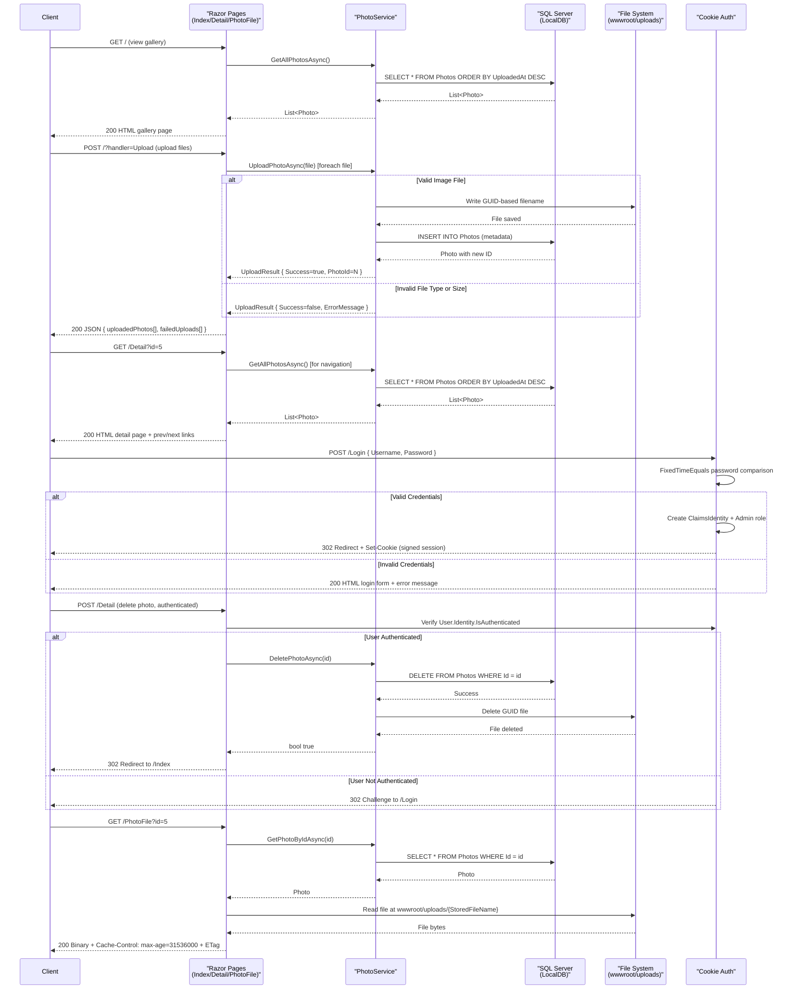

# API & Service Communication Contracts

The PhotoAlbum application is a single-service ASP.NET Core web application with a Razor Pages presentation layer that exposes photo gallery operations through HTTP endpoints. All endpoints follow REST conventions with synchronous request-response patterns, cookie-based authentication for state-changing operations, and no inter-service communication.

## Service Catalog

| Service | Port | Category | Purpose | Key Frameworks |
|---------|------|----------|---------|-----------------|
| PhotoAlbum | 5000 | API Layer (Web UI) | Photo gallery management: upload, view, delete photos with admin authentication | ASP.NET Core 9.0, Entity Framework Core 9.0, SixLabors.ImageSharp 3.1.11 |

## API Endpoints Inventory

| Service | Method | Path | Request Type | Response Type | Authentication | Purpose |
|---------|--------|------|--------------|---------------|-----------------|---------|
| PhotoAlbum | GET | / | — | HTML (Razor Page) | Public | Display photo gallery grid with thumbnails and upload form |
| PhotoAlbum | POST | /?handler=Upload | `List<IFormFile>` (multipart/form-data) | JSON (`{ success, uploadedPhotos[], failedUploads[] }`) | Public | Bulk upload one or more photos; returns array of uploaded Photo metadata or error details per file |
| PhotoAlbum | GET | /Detail | Query param: `id={int}` | HTML (Razor Page) | Public | Display full-size photo with metadata, previous/next navigation links |
| PhotoAlbum | POST | /Detail | Form data: `id={int}` | Redirect to /Index | **Authenticated (Admin)** | Delete a photo; unauthenticated users are challenged to login (CWE-306) |
| PhotoAlbum | GET | /PhotoFile | Query param: `id={int}` | Binary file (image/* MIME type) with 1-year cache headers and ETag | Public | Serve photo file with optimized caching (immutable content, ETag-based validation) |
| PhotoAlbum | GET | /Login | — | HTML (Razor Page) | Public | Login page with return URL support |
| PhotoAlbum | POST | /Login | Form data: `Username`, `Password`, `ReturnUrl` | Redirect to ReturnUrl or /Index | Public | Authenticate admin user; sets cookie-based session (fixed-time password comparison, CWE-306) |
| PhotoAlbum | GET | /Privacy | — | HTML (Razor Page) | Public | Privacy policy page |
| PhotoAlbum | GET | /Error | — | HTML (Razor Page) | Public | Error page (development and production pipelines) |

## Management & Observability Endpoints

| Service | Endpoint | Purpose | Custom Metrics |
|---------|----------|---------|-----------------|
| PhotoAlbum | (none configured) | No explicit management endpoints (e.g., /health, /info) | Logging via `ILogger<T>` injected into page models and services; no Prometheus or Application Insights integration |

## DTOs & Contracts

**Domain Entity:**
- **Photo** — Service-owned domain model representing a persisted photo record with metadata (id, OriginalFileName, StoredFileName, FilePath, FileSize, MimeType, UploadedAt, Width, Height). Persisted to SQL Server via Entity Framework Core. Directly returned as response model in gallery views and detail page.

**Data Transfer Objects:**
- **UploadResult** — Internal DTO for `IPhotoService.UploadPhotoAsync()` response; contains success flag, PhotoId, FileName, and optional ErrorMessage. Not directly exposed in API responses; handler constructs anonymous JSON objects (success, uploadedPhotos[], failedUploads[]) for client consumption.
- **Anonymous JSON response objects** — Upload handler returns anonymous objects with properties: `id`, `originalFileName`, `filePath`, `uploadedAt`, `fileSize`, `width`, `height` for successful uploads; `fileName`, `error` for failures.

**Serialization:**
- Razor Pages rendering uses default ASP.NET Core JSON serialization (System.Text.Json) for JSON responses.
- No OpenAPI/Swagger specification generated; no GraphQL or gRPC schemas.
- Form posts and file uploads use `application/x-www-form-urlencoded` and `multipart/form-data`.

**Immutability:**
- Photo and UploadResult are mutable C# classes (not records); designed for EF Core tracking and internal use.

## Communication Patterns

**Synchronous Communication:**
- All endpoints follow REST over HTTP(S) using synchronous request-response model.
- No client-side load balancing or service-to-service discovery; single monolithic service.
- No inter-service calls; PhotoService operates only on local database and file system.

**Authentication & Authorization:**
- **Authentication:** Cookie-based authentication scheme (`CookieAuthenticationDefaults.AuthenticationScheme`). Admin login endpoint validates credentials with fixed-time string comparison (mitigates CWE-327 timing attacks). Login success creates a signed claims-based identity with Admin role and sets an HTTP-only cookie.
- **Authorization:** Destructive operations (photo delete) protected by `User.Identity.IsAuthenticated` check. Unauthenticated requests receive HTTP 302 Challenge response redirecting to `/Login` (CWE-306 mitigation). No fine-grained role checks; Admin role assignment is automatic upon successful login.
- **Transport Security:** HTTPS enforced in production via `UseHsts()` (30-day HSTS header) and `UseHttpsRedirection()`. In development, HTTP is permitted for local testing.

**Resilience & Error Handling:**
- No explicit circuit breaker, retry policy, or bulkhead patterns implemented at the HTTP layer.
- Database operations in PhotoService catch and log exceptions; caller (page model) handles caught exceptions by logging and returning user-friendly error states (e.g., empty photo list on load error, TempData error message on delete failure).
- File upload validation fails fast with user-facing error messages (oversized file, unsupported MIME type, zero-length file).
- No timeout policies configured; default ASP.NET Core request timeout (30 seconds on IIS) applies.

**Data Persistence & Consistency:**
- Single SQL Server LocalDB instance via Entity Framework Core 9.0. No distributed transactions or eventual consistency patterns.
- Photo deletion transactional: database delete followed by file system cleanup on success; rollback on db exception ensures no orphaned files.
- File uploads write to wwwroot/uploads on disk and insert Photo record in database. If database insert fails, uploaded file is deleted (transactional semantics via exception handling in PhotoService).

**Caching:**
- Static assets (CSS, JS, images in wwwroot) cached client-side for 1 hour (Cache-Control: public,max-age=3600).
- Photo files served with 1-year cache directives (Cache-Control: public,max-age=31536000) and ETag headers derived from photo ID and upload timestamp, enabling efficient 304 Not Modified responses.
- No server-side caching layer; every GetAllPhotosAsync() query hits the database.

**File Storage:**
- Photos stored in wwwroot/uploads as GUID-based filenames (CWE-22 mitigation: path traversal attacks prevented by removing user-supplied filename and using GUID).
- Designed for easy swapping to Azure Blob Storage: IPhotoService abstraction already in place; storage implementation can be replaced without changing page models or endpoints.
- File upload validation uses ImageSharp to detect real image format (ignores client-supplied Content-Type, mitigating CWE-434 arbitrary file upload).

**Security Posture:**
- **Authentication:** Present via cookie-based scheme; admin login protects delete operations.
- **Authorization:** Present; Admin role required for delete. Anonymous users cannot modify state.
- **TLS/Transport Security:** HTTPS enforced in production; HSTS header set.
- **Input Validation:** File MIME type and size validated; file content format verified via ImageSharp; stored filename GUID-based (not user input); form posts validated via ASP.NET Core data annotations (Photo model).
- **Missing Controls:** No request rate limiting, DDoS protection, CSRF tokens (Razor Pages anti-forgery tokens not explicitly shown in code snippet), or API key authentication.

## Service Technology Matrix

| Service | Web Framework | Data Access | Discovery | Gateway | Actuator | Cache | Metrics |
|---------|---------------|-------------|-----------|---------|----------|-------|---------|
| PhotoAlbum | Razor Pages (ASP.NET Core MVC) | Entity Framework Core 9.0 (SQL Server) | None (single service) | None | None | Static file cache headers; photo ETag-based caching | ILogger<T> (built-in, no Prometheus/App Insights export) |

## Service Communication Sequence

## Notes

- **No inter-service communication:** This is a monolithic single-service application. All logic is contained within PhotoAlbum service.
- **Storage abstraction:** IPhotoService interface allows PhotoService implementation to be swapped (e.g., local file system → Azure Blob Storage) without changing page models or HTTP endpoints.
- **Database migrations:** Entity Framework Core migrations applied automatically on startup (in non-test environments), ensuring schema is always current.
- **Error handling:** Errors caught in service and page model layers; user-facing error messages logged and displayed via TempData or JSON responses.
- **Testing:** Application uses xUnit with `Microsoft.AspNetCore.Mvc.Testing` for integration tests; test environment uses in-memory EF Core database, skipping real migrations.
