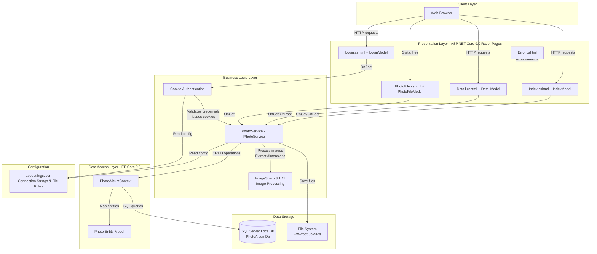
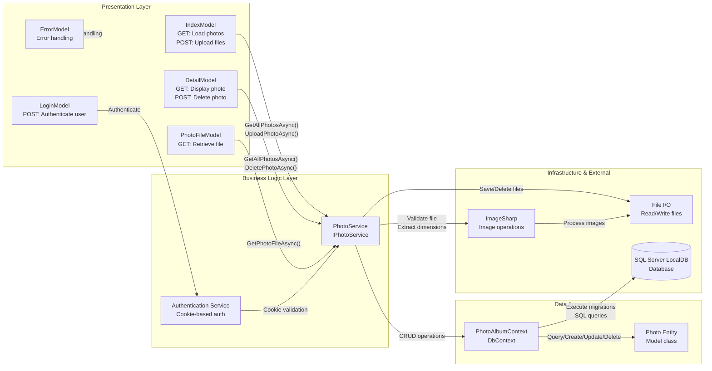

# Architecture Diagram

PhotoAlbum is an ASP.NET Core 9.0 Razor Pages application that manages a photo gallery with file upload, storage, and retrieval capabilities. The application demonstrates modern cloud-ready patterns with service layer abstraction, transactional consistency, and configuration-driven deployment.

## Application Architecture

### Technology Stack Summary

| Layer | Technology | Version | Purpose |
|-------|-----------|---------|---------|
| Presentation | ASP.NET Core Razor Pages | 9.0 | Server-side web framework for page rendering and form handling |
| Presentation | C# | 12.0 (implicit) | Primary programming language |
| Business Logic | PhotoService | Custom | Service layer abstracting photo operations and file handling |
| Business Logic | SixLabors.ImageSharp | 3.1.11 | Image processing library for dimension extraction and format validation |
| Authentication | ASP.NET Core Identity (Cookies) | 9.0 | Cookie-based authentication for admin operations |
| Data Access | Entity Framework Core | 9.0 | ORM for database operations and migrations |
| Data Storage | SQL Server LocalDB | 2022+ | Local development database with automatic migration support |
| File Storage | Windows File System | N/A | GUID-based photo file storage in wwwroot/uploads |
| Configuration | appsettings.json | N/A | Externalized configuration for connection strings and file upload rules |

### Data Storage & External Services

The application uses **SQL Server LocalDB** as the primary data store, managing photo metadata including original filename, stored filename, file size, MIME type, image dimensions, and upload timestamps. Photos are stored on the **local file system** in `wwwroot/uploads/` with GUID-based filenames to prevent collisions and security issues. Configuration is externalized through `appsettings.json`, enabling easy customization of database connection strings, file size limits (10MB default), allowed MIME types (JPEG, PNG, GIF, WebP), and upload paths. The application is designed for migration to **Azure Blob Storage** as evidenced by the service layer abstraction through `IPhotoService`, allowing transparent swapping of storage implementations.

### Key Architectural Decisions

- **Service Layer Abstraction**: `IPhotoService` interface decouples business logic from storage implementation, enabling future migration from local file storage to Azure Blob Storage without affecting page models or request handlers.
- **Transactional Consistency**: File deletion on database save failure prevents orphaned files, ensuring data consistency between the database and file system.
- **Configuration-Driven Deployment**: File size limits, allowed MIME types, upload paths, and database connection strings are externalized in `appsettings.json`, enabling environment-specific configurations without code changes.

## Component Relationships

### Component Inventory

| Component | Layer | Type | Responsibility |
|-----------|-------|------|-----------------|
| IndexModel | Presentation | Razor Page Model | Handles gallery view (GET) and multi-file upload (POST) requests; delegates to PhotoService for data operations |
| DetailModel | Presentation | Razor Page Model | Displays single photo in full size (GET) with metadata and navigation; handles authenticated photo deletion (POST) |
| LoginModel | Presentation | Razor Page Model | Processes login form submissions and establishes authenticated sessions |
| PhotoFileModel | Presentation | Razor Page Model | Retrieves photo files by ID for direct download or display |
| ErrorModel | Presentation | Razor Page Model | Centralized error page and global exception handling |
| PhotoService | Business Logic | Service | Core business logic for photo upload validation, file processing, database persistence, and deletion; abstracts storage implementation |
| Authentication Service | Infrastructure | Middleware | Manages cookie-based authentication, validates user credentials, protects admin operations like photo deletion |
| PhotoAlbumContext | Data Access | EF Core DbContext | Maps Photo entity to database tables; manages database schema, migrations, and connection lifecycle |
| Photo Entity | Data Access | Entity Model | Represents photo metadata (original filename, stored filename, dimensions, MIME type, file size, upload timestamp) |
| ImageSharp Library | Infrastructure | External Library | Processes uploaded images to extract dimensions and validate format before storage |
| File I/O | Infrastructure | System | Handles physical file operations (save, retrieve, delete) on the file system in wwwroot/uploads/ |
| SQL Server LocalDB | Data Storage | Database | Stores photo metadata with descending index on UploadedAt for efficient chronological queries |
