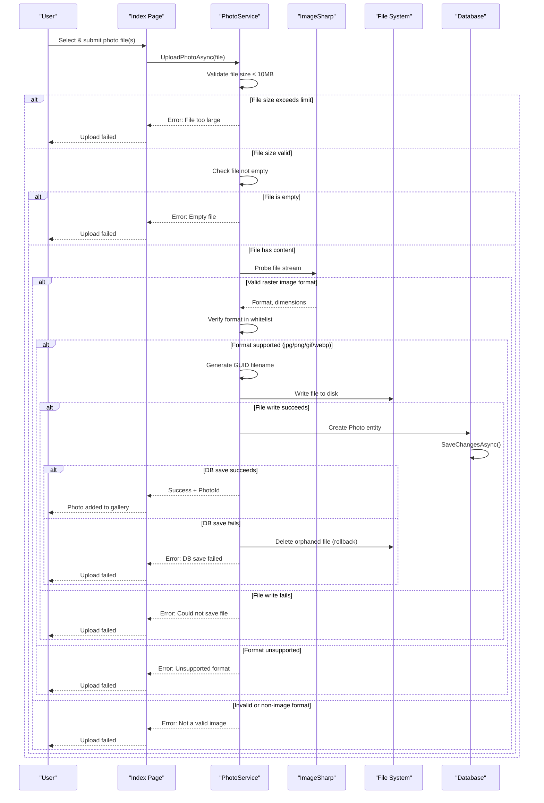

# Core Business Workflows

PhotoAlbum is a web-based photo gallery management application that enables users to upload, view, and manage personal photo collections with automatic metadata extraction and security-focused content validation.

## Domain Entities

| Entity | Service / Bounded Context | Description | Key Relationships |
|--------|---------------------------|-------------|-------------------|
| Photo | Photo Management | Represents an uploaded photo with metadata (original filename, stored filename, file path, size, MIME type, dimensions, and upload timestamp). Serves as the primary domain entity for gallery management and storage lifecycle. | Owned entity; no external relationships |

## Service-to-Domain Mapping

| Service | Domain Context | Owned Entities | External Dependencies |
|---------|----------------|----------------|----------------------|
| PhotoService | Photo Management | Photo | File system (wwwroot/uploads), SQL Server LocalDB via Entity Framework Core, ImageSharp library for content validation |

## Primary Workflows

### Workflow 1: View Gallery

**Entry Point**: GET /Index (Razor Page)

Users access the main gallery to browse all uploaded photos in a chronological grid layout (newest first). The workflow retrieves all photos from the database, ordered by upload date descending, and displays them with thumbnails.

**Steps**:
1. User navigates to Index page
2. IndexModel.OnGetAsync() triggers
3. PhotoService.GetAllPhotosAsync() queries database for all photos
4. Photos ordered by UploadedAt descending (via database index)
5. Razorpage renders gallery grid with photo previews and metadata
6. User can click on any photo to view details

**Business Rules Involved**:
- Chronological Ordering: Photos must be displayed newest first
- Error Handling: If database fails, empty list is returned (graceful degradation)

---

### Workflow 2: View Photo Detail

**Entry Point**: GET /Detail?id={photoId} (Razor Page)

Users click on a photo from the gallery to view it in full size with metadata and navigation controls. The page enables browsing through adjacent photos chronologically.

**Steps**:
1. User clicks photo in gallery
2. DetailModel.OnGetAsync(id) triggers
3. PhotoService.GetAllPhotosAsync() retrieves full photo list
4. Photo matching requested ID is loaded
5. Previous and next photo IDs calculated based on chronological position
6. Full-size image displayed with metadata (original name, size, dimensions, upload date)
7. Navigation links allow traversing adjacent photos

**Business Rules Involved**:
- Chronological Navigation: Previous/Next are determined by upload date order (reversed due to descending sort)
- Resource Existence: Returns NotFound if photo ID doesn't exist
- Error Handling: Returns NotFound on database errors

---

### Workflow 3: Upload Photo

**Entry Point**: POST /Index?handler=Upload (Razor Page AJAX handler)

Users upload photo files via the gallery UI with comprehensive validation and metadata extraction. The workflow ensures file integrity, validates content, and maintains transactional consistency.

**Steps**:
1. User selects one or more files from file browser
2. IndexModel.OnPostUploadAsync(files) receives multipart form data
3. For each file:
   - **Size Validation**: File.Length must not exceed 10MB limit
   - **Empty File Check**: File.Length must be > 0
   - **Content Validation**: ImageSharp probes file stream to:
     - Detect actual image format (not trusting Content-Type header)
     - Extract image dimensions (Width, Height)
     - Validate format is supported (jpg, jpeg, png, gif, webp)
   - If validation fails, error returned immediately; no file persisted
4. **Safe Filename Generation**: Create GUID-based filename with safe extension from detected format
5. **Directory Verification**: Ensure uploads directory exists (create if needed)
6. **File Persistence**: Write file stream to disk at wwwroot/uploads/{guid}.{ext}
7. **Database Transaction**:
   - Create Photo entity with metadata (original name, stored name, file path, size, MIME type, dimensions, current UTC timestamp)
   - Persist to database via SaveChangesAsync()
8. **Transaction Rollback**: If database save fails:
   - Delete file from disk to prevent orphaned files
   - Return error to client
9. **Success Response**: Return JSON with photo ID, thumbnail path, and metadata for AJAX client to update gallery

**Business Rules Involved**:
- **FileUploadValidator**: Enforces size limit (10MB), MIME type whitelist, and image format detection
- **ContentSecurityValidator**: Validates actual file content (prevents CWE-434 unrestricted upload, CWE-79 stored XSS via .html/.svg)
- **TransactionalConsistency**: File and database must be in sync; rollback file if DB fails
- **SafeFilenameGeneration**: Use GUID to prevent filename injection attacks
- **ImageMetadataExtraction**: Capture dimensions for gallery rendering optimization

---

### Workflow 4: Delete Photo

**Entry Point**: POST /Detail?handler=Delete&id={photoId} (Razor Page handler)

Authenticated users delete photos permanently from the gallery and disk storage. The operation requires authentication and removes both database records and physical files.

**Steps**:
1. User clicks delete button on photo detail page
2. DetailModel.OnPostDeleteAsync(id) receives request
3. **Authentication Check**: Verify User.Identity.IsAuthenticated
   - If not authenticated, redirect to login page via Challenge()
4. PhotoService.DeletePhotoAsync(id):
   - Query database for Photo entity by ID
   - If not found, log warning and return false
   - If found:
     - **File Deletion**: Delete file from disk at wwwroot/uploads/{StoredFileName}
       - If file deletion fails, log error but continue
     - **Database Deletion**: Remove Photo entity from context
     - Persist deletion via SaveChangesAsync()
5. **Success Response**: Log deletion event, redirect to Index page
6. **Error Response**: Log error, set TempData error message, redirect to Detail page

**Business Rules Involved**:
- **AuthenticationRequirement**: Delete is destructive operation; requires authenticated user (CWE-306)
- **Resilient File Deletion**: Database deletion proceeds even if file deletion fails (file may already be missing)
- **Idempotent Lookup**: Photo not found is handled gracefully

---

## Cross-Service Data Flows

This is a single-module monolithic application without microservices. All data flows are within PhotoAlbum's single process:

- **Data Source**: SQL Server LocalDB via Entity Framework Core (PhotoAlbumContext)
- **File Storage**: Local file system (wwwroot/uploads)
- **Data Composition**: No cross-service aggregation; all workflows operate on Photo entity directly
- **Fallback Behavior**: Database failures result in error logging and graceful error responses to client; file system failures do not block database operations (resilient design)

---

## Business Workflow Sequence

The following Mermaid diagram illustrates the primary **Upload Photo** workflow, showing validation checks, file persistence, database transaction, and rollback behavior:

---

## Business Rules & Decision Logic

### Validation Rules

- **File Size Validator**
  - Constraint: File.Length ≤ 10,485,760 bytes (10MB)
  - Applied At: Upload entry point (PhotoService.UploadPhotoAsync)
  - Failure Mode: Reject upload, return user-friendly error

- **Empty File Validator**
  - Constraint: File.Length > 0
  - Applied At: After size validation
  - Failure Mode: Reject upload

- **Image Format Content Validator**
  - Constraint: File must be decodable by ImageSharp; actual image format must match one of: jpg, jpeg, png, gif, webp
  - Applied At: After empty check; probes file stream (never trusts Content-Type or filename)
  - Failure Mode: Reject upload; prevents CWE-434 (unrestricted upload) and CWE-79 (stored XSS via .html/.svg)

### Decision Logic

- **Authentication for Delete**
  - Rule: User.Identity.IsAuthenticated must be true
  - Applied At: DetailModel.OnPostDeleteAsync (CWE-306)
  - Fallback: Redirect to login (Challenge())

- **Chronological Photo Ordering**
  - Rule: Photos displayed newest first (OrderByDescending UploadedAt)
  - Applied At: GetAllPhotosAsync via database index
  - Business Impact: Users always see latest uploads first in gallery

- **Transactional Consistency**
  - Rule: If Photo persisted to database, corresponding file must exist on disk; if database save fails after file write, delete file
  - Applied At: PhotoService.UploadPhotoAsync
  - Business Impact: Prevents orphaned files; ensures gallery state is always consistent

- **Safe Filename Generation**
  - Rule: Generate GUID-based filename using detected image format's canonical extension (not user-supplied filename)
  - Applied At: PhotoService.UploadPhotoAsync
  - Business Impact: Prevents filename injection attacks; each file is uniquely identifiable

### State Transitions

- **Photo Lifecycle**
  - Initial State: Not yet uploaded
  - Transition: File uploaded + validated → Photo entity created in database
  - Active State: Photo persisted in database and file on disk; queryable via GetAllPhotosAsync, GetPhotoByIdAsync
  - Terminal State: DeletePhotoAsync removes entity from database and file from disk

### Business Constraints

- **File Upload Capacity**
  - Single file: ≤10MB
  - Multipart body limit: 10MB (configured in FormOptions)
  - Allowed MIME types: image/jpeg, image/png, image/gif, image/webp

- **Storage Naming**
  - Stored filenames: GUID format (prevents collisions, improves query efficiency)
  - Original filename: Preserved for user reference (max 255 chars)
  - File paths: Relative to wwwroot (/uploads/{guid}.{ext})

### Cross-Cutting Concerns

- **Transactions**
  - Scope: Each upload is a single transaction (file write + database insert)
  - Consistency: Rollback deletes file if SaveChangesAsync fails
  - Isolation: EF Core handles database isolation; file operations are atomic

- **Error Handling**
  - Business Exceptions: UploadPhotoAsync returns UploadResult (not exception) for validation failures
  - System Exceptions: DeletePhotoAsync, GetAllPhotosAsync throw exceptions (caller handles via try/catch and logging)
  - Graceful Degradation: Gallery displays empty list if database unavailable; file deletion continues if file delete fails

- **Audit & Logging**
  - ILogger<PhotoService> logs all major operations (upload success/failure, delete success, errors)
  - Log Details: File names, photo IDs, error reasons
  - Diagnostic Value: Supports troubleshooting file system issues, database issues, and upload rejection reasons

- **Authorization**
  - Public Read: Gallery view (Index, Detail, PhotoFile) accessible to all users
  - Authenticated Write: Delete operations require IsAuthenticated flag
  - No Role-Based Authorization: Single admin role assumption (all authenticated users can delete)
