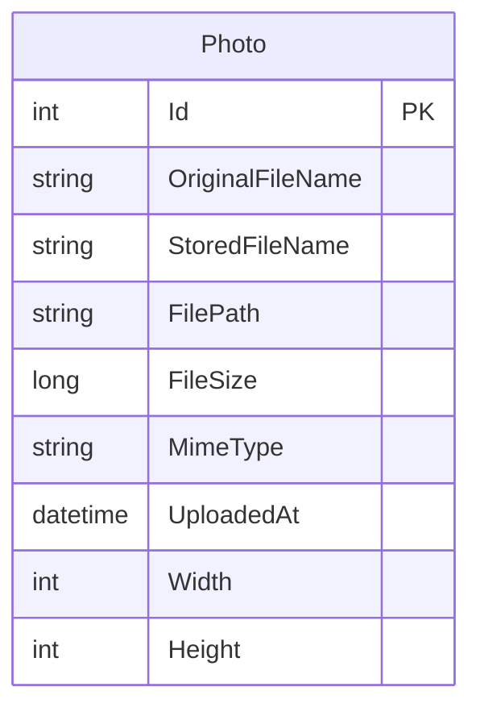

# Data Architecture & Persistence Layer

PhotoAlbum uses SQL Server LocalDB as its primary database with a single Photo entity managed through Entity Framework Core 9.0. The data layer is straightforward, exposing photo CRUD operations through the PhotoService abstraction.

## Database Configuration

| Service/Module | DB Type | Profile | Driver | Connection String | Migration Tool |
|---|---|---|---|---|---|
| PhotoAlbum | SQL Server LocalDB | All (Development, Production, Test) | Microsoft.EntityFrameworkCore.SqlServer (9.0.9) | `Server=(localdb)\mssqllocaldb;Database=PhotoAlbumDb;Trusted_Connection=true;MultipleActiveResultSets=true` | EF Core Migrations |

**Database Behavior:**
- EF Core manages schema; auto-migration runs on startup in all environments except when `IsTestEnvironment` flag is set to `true`
- Trusted authentication for LocalDB (Windows-integrated security)
- Multiple active result sets enabled for concurrent queries
- Test environment skips auto-migration to use in-memory database

## Data Ownership per Service

| Service | Tables Owned | ORM Framework | Caching | Notes |
|---|---|---|---|---|
| PhotoService | Photos | EF Core 9.0 | None (application level) | Single entity; scoped lifetime; transactional consistency on upload/delete |

## Entity Model

## Key Repository Methods

| Service | Repository | Notable Methods | Purpose |
|---|---|---|---|
| PhotoService | IPhotoService | `GetAllPhotosAsync()` | Retrieve all photos ordered by upload date (newest first); uses descending index on UploadedAt for performance |
| PhotoService | IPhotoService | `GetPhotoByIdAsync(int id)` | Retrieve a single photo by ID; used for detail page and file serving |
| PhotoService | IPhotoService | `UploadPhotoAsync(IFormFile file)` | Upload photo with validation (size, MIME type, image format verification); stores metadata in database and file on disk; transactional rollback on failure |
| PhotoService | IPhotoService | `DeletePhotoAsync(int id)` | Delete photo record and associated file; handles orphaned file cleanup if DB save fails |

**Database Index:**
- `IX_Photos_UploadedAt` (descending): supports chronological gallery queries for newest-first retrieval

## Caching Strategy

**HTTP-Level Static File Caching:**
- Static files (CSS, JS, images) cached for 1 hour via `Cache-Control: public,max-age=3600` header
- Applied at middleware layer (`UseStaticFiles`) for uploads and static assets

**Application-Level Caching:**
- No distributed cache (Redis, IDistributedCache) configured
- No EF Core second-level cache configured
- Gallery queries execute directly against database each request
- Photo details retrieved fresh per request

**Rationale:**
- Photo gallery is read-heavy but updates are infrequent (admin-only delete operations)
- Caching strategy is simple by design; no invalidation complexity
- Static files served by HTTP layer with standard cache headers
- Upload/delete operations are synchronous and transactional; no async cache invalidation needed

## Data Ownership Boundaries

**Data Store Topology:**
- Single SQL Server LocalDB instance
- All data centralized in one database: `PhotoAlbumDb`
- No per-service or per-tenant data isolation
- No cross-service data access patterns (single service)

**Cross-Service Data Access:**
- No cross-service queries (only PhotoService accesses Photos table)
- Read-only gallery endpoints (`Index`, `Detail`) query Photos directly
- State-changing operations (`Delete`) require authentication and are initiated only via Razor Pages

**Data Access Patterns:**
- **Query path:** PhotoService → EF Core DbContext → SQL Server → Photos table
- **Upload path:** IFormFile → validation → disk storage (wwwroot/uploads) → Photo entity → database
- **Delete path:** Photo lookup → disk file cleanup → database removal

### Data Classification & Sensitivity

| Entity | Sensitive Fields | Classification | Controls in Place |
|---|---|---|---|
| Photo | OriginalFileName | User-supplied metadata (not PII) | No encryption-at-rest configured in application; SQL Server encryption configured at database server level (if applicable) |
| Photo | FilePath, StoredFileName, FileSize, MimeType, Width, Height | Non-sensitive metadata | None required |
| Photo | UploadedAt | UTC timestamp | None required |

**Security Notes:**
- OriginalFileName stores the user-supplied filename but is not sensitive personal information
- File content itself stored on disk in `wwwroot/uploads/` with GUID-based names (original filenames are not used for storage)
- Image format and dimensions verified from file content (not from headers) to prevent XSS and unrestricted file upload vulnerabilities (CWE-434, CWE-79)
- Authentication required for delete operations (CWE-306); read access is public
- No PII, PHI, or PCI data detected in entity model

