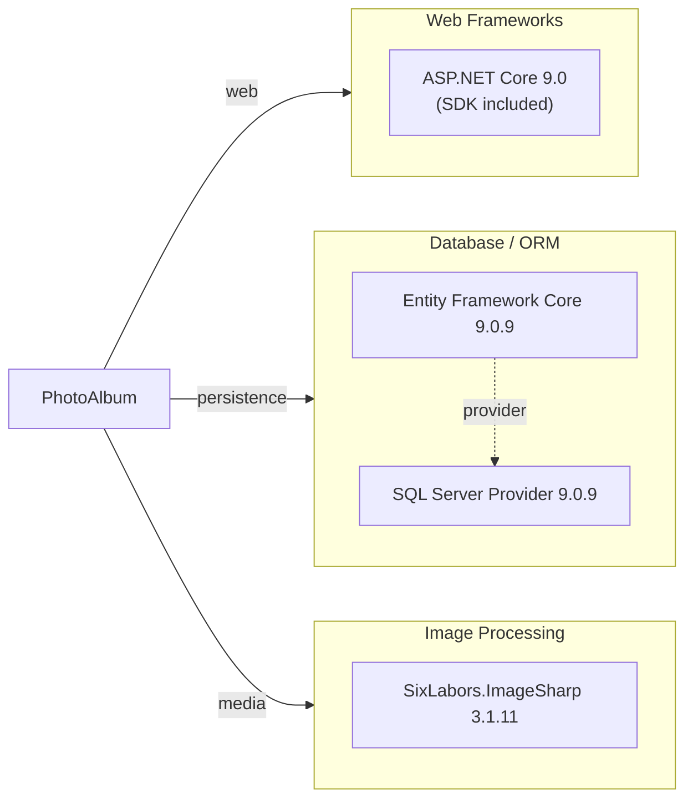

# Dependency Map

PhotoAlbum is an ASP.NET Core 9.0 Razor Pages application with a lean dependency footprint of 6 declared external production dependencies plus 6 test-scoped dependencies focused on modern cloud-native practices.

## Dependencies

### Dependency Summary

| Category | Count | Key Libraries | Notes |
|----------|-------|----------------|-------|
| Web Frameworks | 1 | ASP.NET Core 9.0 | Modern .NET web framework with Razor Pages support |
| Database / ORM | 2 | Entity Framework Core 9.0.9, SQL Server Provider 9.0.9 | Latest EF Core with SQL Server LocalDB support |
| Image Processing | 1 | SixLabors.ImageSharp 3.1.11 | Pure .NET image manipulation library for JPEG, PNG, GIF, WebP |
| **Total Production** | **4** | | |

### Version & Compatibility Risks

All production dependencies are on **current stable versions** from .NET 9.0 ecosystem. ASP.NET Core 9.0 and Entity Framework Core 9.0 were released in November 2024 with long-term support. SixLabors.ImageSharp 3.1.11 is the latest stable release with active maintenance. No deprecated or end-of-life dependencies detected. The application is well-positioned for modernization and cloud deployment with no version upgrade concerns.

### Notable Observations

- **Minimal production footprint**: Only 3 external NuGet packages (EF Core Design is build-time only) demonstrates a lean, focused architecture well-suited for containerization and cloud deployment.
- **Modern framework stack**: ASP.NET Core 9.0 and EF Core 9.0 represent the latest stable releases with strong cloud-native support (Aspire, dependency injection, async/await patterns).
- **Pure .NET dependencies**: SixLabors.ImageSharp is a managed .NET library with no native OS dependencies, improving portability for cloud environments (containers, serverless).
- **LocalDB development only**: SQL Server LocalDB is used for local development; migration to Azure SQL Database for production is straightforward with no code changes required.

## Test Dependencies

| Framework | Version | Scope | Notes |
|-----------|---------|-------|-------|
| xUnit | 2.9.2 | Test | Modern .NET unit testing framework with fluent assertions |
| xunit.runner.visualstudio | 2.8.2 | Test | Visual Studio test runner integration |
| Microsoft.NET.Test.Sdk | 17.12.0 | Test | Cross-platform test execution engine |
| Microsoft.AspNetCore.Mvc.Testing | 9.0.9 | Test | Integration testing utilities for ASP.NET Core |
| Microsoft.EntityFrameworkCore.InMemory | 9.0.9 | Test | In-memory database provider for isolated unit tests |
| coverlet.collector | 6.0.2 | Test | Code coverage collection and reporting |

**Total test-scope dependencies: 6**

The test infrastructure is modern and well-structured for ASP.NET Core 9.0, with in-memory EF Core provider enabling fast, isolated unit tests and WebApplicationFactory supporting integration tests. Code coverage tracking via Coverlet ensures visibility into test quality. No test framework or infrastructure concerns identified.
